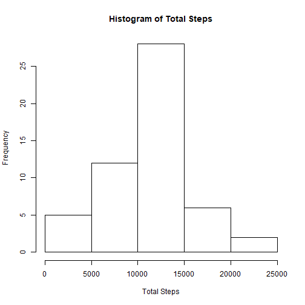
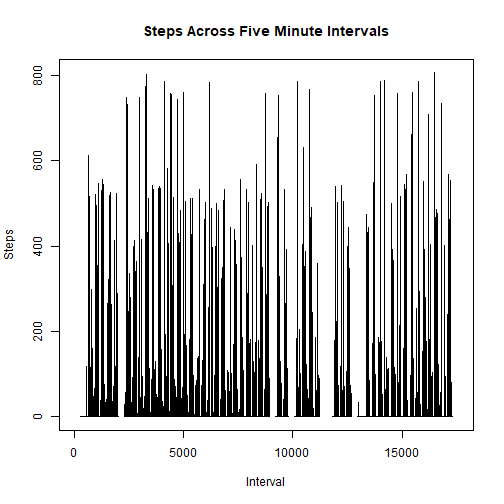
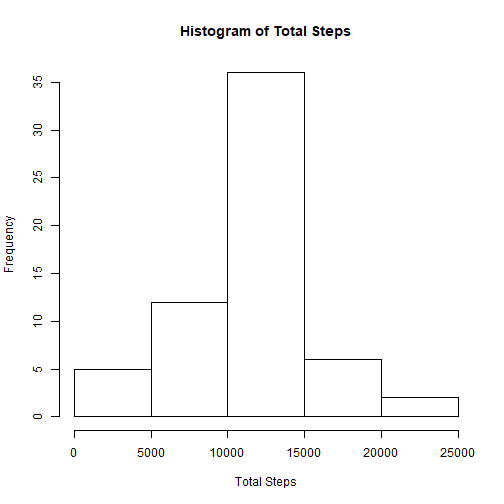
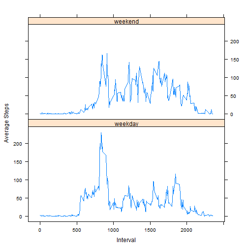

Store the activity csv into a table.

```r
data <- read.csv("activity.csv")
```

Get the mean total number of steps taken per day.

```r
steps <- aggregate(data$steps, by=list(date=data$date), FUN=sum)
```

Create a histogram of the total number of steps per day.

```r
hist(steps$x, main="Histogram of Total Steps", xlab="Total Steps")
```



Calculate the mean and median of the total number of steps taken per day.

```r
mean_steps <- mean(na.omit(steps$x))
median_steps <- median(na.omit(steps$x))
```
The mean is 1.0766189 &times; 10<sup>4</sup> and the median is 10765.

Create a time series plot of the steps across a five minute interval.

```r
plot(data$steps, type="l", main="Steps Across Five Minute Intervals", xlab="Interval", ylab="Steps")
```



Find the five minute interval with the greatest number of steps.

```r
no_na = na.omit(data)
max_steps <- aggregate(no_na$steps, by=list(interval=no_na$interval), FUN=mean)
greatest <- max(max_steps$x)
interval <- max_steps[max_steps$x == greatest,][1, "interval"]
```
The interval with the greatest average number of steps is 835.

Find the total number of missing values in the dataset.

```r
total_na <- sum(is.na(data$steps))
```
The total number of missing values in the dataset is 2304.

To fill the missing values we can use this procedure.

```r
no_na_average <- aggregate(no_na$steps, by=list(interval=no_na$interval), FUN=mean)
intervals <- unique(data$interval)
fill_na <- data.frame(data)
for (inter in intervals) {
  fill_na$steps[is.na(fill_na$steps) & fill_na$interval == inter] <- no_na_average$x[no_na_average$interval == inter]
}
```

Create a histogram of the total number of steps per day with the filled values.

```r
filled_steps <- aggregate(fill_na$steps, by=list(date=fill_na$date), FUN=sum)
hist(filled_steps$x, main="Histogram of Total Steps", xlab="Total Steps")
```



Calculate the mean and median of the total number of steps taken per day with the filled values.

```r
filled_mean_steps <- mean(filled_steps$x)
filled_median_steps <- median(filled_steps$x)
```
The mean is 1.0766189 &times; 10<sup>4</sup> and the median is 1.0766189 &times; 10<sup>4</sup>.

These values only differ slightly from the original values.
The impact of inputing missing data in the fashion is only slight.

Creating new factor variable in dataset for weekday and weekend.

```r
fill_na$day <- "weekday"
fill_na$day[weekdays(as.Date(fill_na$date)) == "Sunday" | weekdays(as.Date(fill_na$date)) == "Saturday"] <- "weekend"
```

Creating a time series graph comparing average steps on weekends versus weekdays.

```r
library("lattice")
weekend <- fill_na[fill_na$day == "weekend",]
weekend_mean <- aggregate(weekend$steps, list(weekend$interval), mean)
weekend_mean$day <- "weekend"
weekday <- fill_na[fill_na$day == "weekday",]
weekday_mean <- aggregate(weekday$steps, list(weekday$interval), mean)
weekday_mean$day <- "weekday"
day_means <- rbind(weekend_mean, weekday_mean)
xyplot(day_means$x ~ day_means$Group.1 | day_means$day, day_means, type="l", layout = c(1, 2), xlab = "Interval", ylab = "Average Steps")
```



